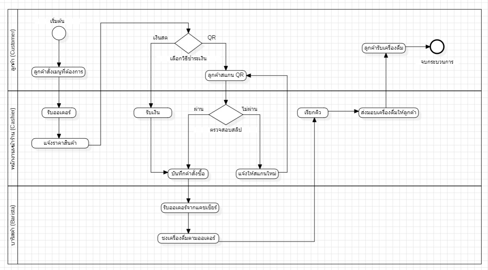
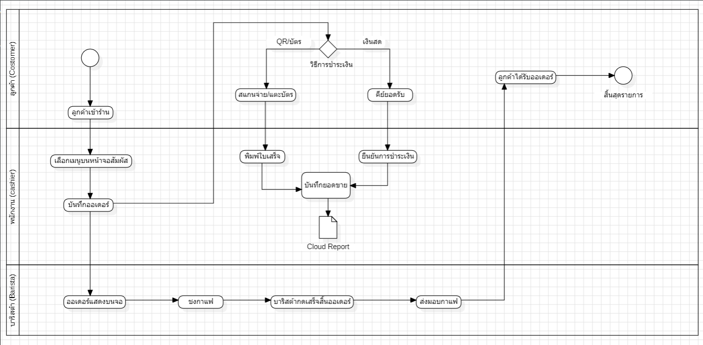

# BPMN To-Be กับ Operational และ Economic Feasibility

## 1. Operational Feasibility

BPMN แบบ To-Be ช่วยปรับปรุงกระบวนการทำงานโดยนำระบบอัตโนมัติเข้ามาใช้ เช่น การตรวจสอบสต็อกอัตโนมัติ และการยืนยันการชำระเงินผ่านระบบ ทำให้ลดขั้นตอนที่ต้องใช้แรงงานคน ลดความผิดพลาด และเพิ่มความรวดเร็วในการให้บริการ ส่งผลให้ระบบสามารถใช้งานได้จริงและมีประสิทธิภาพมากขึ้น

---

## 2. Economic Feasibility

BPMN แบบ To-Be ช่วยลดต้นทุนการดำเนินงาน เช่น ลดจำนวนพนักงานที่ต้องใช้ ลดความผิดพลาดที่ทำให้เกิดค่าใช้จ่ายเพิ่มเติม และเพิ่มความสามารถในการรองรับลูกค้าได้มากขึ้น ส่งผลให้ธุรกิจมีประสิทธิภาพสูงขึ้นและเพิ่มกำไรในระยะยาว

---

## สรุป

BPMN แบบ To-Be ช่วยให้ระบบมีความเหมาะสมทั้งในด้านการใช้งาน (Operational) และด้านความคุ้มค่า (Economic) โดยลดต้นทุน เพิ่มประสิทธิภาพ และเพิ่มความสามารถในการแข่งขันของธุรกิจ

---

# รายงานการศึกษาความเป็นไปได้ (TELOS Feasibility Study)

## 🔹 1. Technical Feasibility (ความเป็นไปได้ด้านเทคนิค)

การพัฒนาระบบสามารถดำเนินการได้โดยใช้เทคโนโลยีที่มีอยู่ในปัจจุบัน เช่น ระบบฐานข้อมูล (Database), ระบบเว็บแอปพลิเคชัน และเครื่องมือออกแบบกระบวนการอย่าง BPMN ซึ่งรองรับการทำงานอัตโนมัติ เช่น การตรวจสอบข้อมูล การแจ้งเตือน และการจัดเก็บข้อมูลแบบดิจิทัล

นอกจากนี้ ทีมพัฒนายังมีความรู้และทักษะที่เพียงพอในการใช้เครื่องมือและเทคโนโลยีดังกล่าว จึงทำให้โครงการมีความเป็นไปได้ในด้านเทคนิคสูง

---

## 🔹 2. Economic Feasibility (ความเป็นไปได้ด้านเศรษฐศาสตร์)

โครงการนี้ช่วยลดต้นทุนในระยะยาว เช่น ลดการใช้แรงงาน ลดความผิดพลาดจากมนุษย์ และลดค่าใช้จ่ายในการดำเนินงานแบบเดิม แม้จะมีค่าใช้จ่ายเริ่มต้นในการพัฒนาระบบ เช่น ค่าอุปกรณ์ ค่าโปรแกรม และค่าพัฒนา

แต่เมื่อใช้งานในระยะยาว ระบบจะช่วยเพิ่มประสิทธิภาพและสร้างความคุ้มค่า (Cost-effectiveness) ทำให้องค์กรสามารถประหยัดต้นทุนและเพิ่มกำไรได้

---

## 🔹 3. Operational Feasibility (ความเป็นไปได้ด้านการปฏิบัติงาน)

ระบบที่ออกแบบ (To-Be Process) สามารถแก้ไขปัญหาจากระบบเดิม (As-Is) ได้ เช่น ลดขั้นตอนที่ซ้ำซ้อน เพิ่มความรวดเร็วในการให้บริการ และลดภาระงานของพนักงาน

ผู้ใช้งานสามารถเรียนรู้และใช้งานระบบได้ง่าย เนื่องจากมีการออกแบบให้ใช้งานสะดวก (User-friendly) และสอดคล้องกับกระบวนการทำงานจริง ส่งผลให้ระบบสามารถนำไปใช้งานได้จริงในองค์กร

---

## 🔹 4. Schedule Feasibility (ความเป็นไปได้ด้านระยะเวลา)

โครงการสามารถดำเนินการให้เสร็จภายในระยะเวลาที่กำหนด โดยมีการวางแผนงานอย่างเป็นระบบ เช่น การวิเคราะห์ ออกแบบ พัฒนา และทดสอบระบบ

แต่ละขั้นตอนมีระยะเวลาที่ชัดเจน และสามารถควบคุมให้เป็นไปตามแผนได้ หากไม่มีอุปสรรคที่รุนแรง โครงการจึงมีความเป็นไปได้ในด้านเวลา และสามารถส่งมอบงานได้ตามกำหนด

---

## สรุป

การวิเคราะห์ตามหลัก **TELOS** แสดงให้เห็นว่าโครงการมีความเป็นไปได้ในทุกด้าน ได้แก่

- ด้านเทคนิค → ระบบสามารถพัฒนาได้จริง
- ด้านเศรษฐศาสตร์ → คุ้มค่าในระยะยาว
- ด้านการปฏิบัติงาน → ใช้งานได้จริงและช่วยแก้ปัญหา
- ด้านระยะเวลา → สามารถทำเสร็จตามแผน

ดังนั้นโครงการนี้มีความเหมาะสมในการดำเนินการต่อไป

---

# ภาพประกอบ

## รูป As-Is

## รูป To-Be

