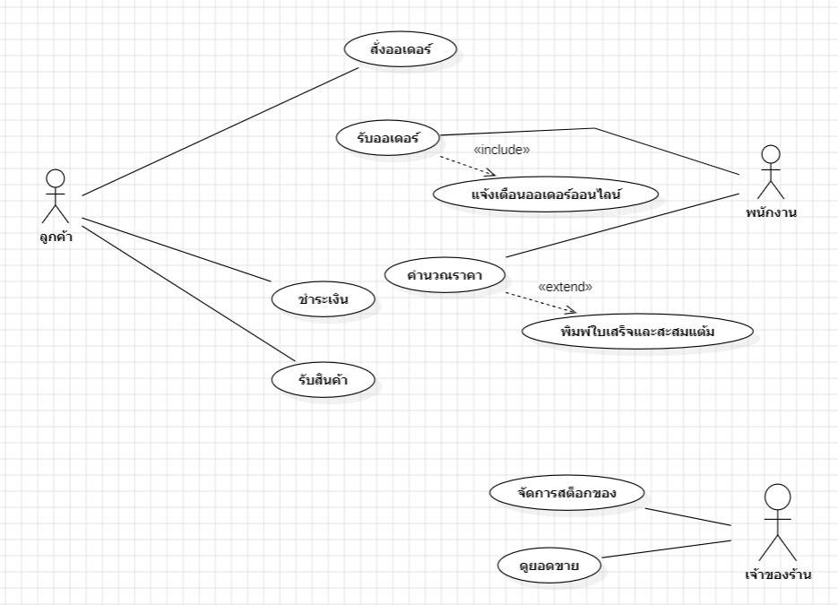

# WK04 - User Stories และ Use Case Diagram

## 1. Use Case Diagram

### ระบบ Minions Cafe

Actors:

- ลูกค้า
- พนักงานร้าน
- เจ้าของร้าน/ผู้ดูแลระบบ

Use Cases:

1. รับออเดอร์และคำนวณราคา
2. ชำระเงินและออกใบเสร็จ
3. จัดการสต็อก
4. ดูยอดขายแบบเรียลไทม์
5. สร้างรายงานยอดขาย
6. จัดการสมาชิกและสะสมแต้ม
7. รับออเดอร์ออนไลน์
8. แจ้งเตือนออเดอร์ออนไลน์

### ความสัมพันธ์ระหว่าง Use Cases

- รับออเดอร์ออนไลน์ `<<include>>` แจ้งเตือนออเดอร์ออนไลน์
- จัดการสมาชิกและสะสมแต้ม `<<extend>>` ชำระเงินและออกใบเสร็จ

> หมายเหตุ: Use Case Diagram ถูกออกแบบใน StarUML และสามารถแทรกรูป Diagram ไว้ในส่วนนี้ได้

---

## 2. Use Case Description

### Use Case: รับออเดอร์และคำนวณราคา

**Actor:** ลูกค้า, พนักงานร้าน

**Precondition:**

- ระบบสามารถแสดงรายการเมนูได้
- ลูกค้าต้องการสั่งสินค้า
- พนักงานสามารถเข้าสู่หน้ารับออเดอร์ได้

### Main Flow

1. พนักงานเปิดหน้ารับออเดอร์
2. ระบบแสดงรายการเมนู
3. พนักงานเลือกเมนูตามที่ลูกค้าต้องการ
4. พนักงานระบุจำนวนสินค้า
5. ระบบคำนวณราคารวมของรายการที่เลือก
6. พนักงานตรวจสอบรายการและราคากับลูกค้า
7. ระบบบันทึกออเดอร์
8. ระบบแสดงยอดรวมที่ต้องชำระ

### Alternative Flow

#### 4a. ลูกค้าต้องการแก้ไขจำนวนสินค้า

1. พนักงานแก้ไขจำนวนสินค้า
2. ระบบคำนวณราคาใหม่
3. ระบบแสดงยอดรวมใหม่
4. กลับไปยังขั้นตอนตรวจสอบรายการ

#### 4b. ลูกค้าเป็นสมาชิก

1. พนักงานตรวจสอบข้อมูลสมาชิก
2. ระบบแสดงข้อมูลสมาชิก
3. ระบบดำเนินการรับออเดอร์ต่อ

### Exception Flow

#### 3a. ไม่พบเมนูที่ลูกค้าต้องการ

1. ระบบแจ้งว่าไม่พบเมนู
2. ระบบไม่เพิ่มรายการดังกล่าวลงในออเดอร์
3. พนักงานแจ้งลูกค้าและให้เลือกเมนูอื่น

#### 4c. จำนวนสินค้ามากกว่าสต็อก

1. ระบบตรวจสอบจำนวนสินค้า
2. ระบบแจ้งว่าสินค้ามีไม่เพียงพอ
3. ระบบไม่บันทึกรายการดังกล่าว
4. พนักงานแจ้งลูกค้าและให้เลือกจำนวนใหม่หรือเมนูอื่น

### Postcondition

**กรณีสำเร็จ:**

- ระบบบันทึกออเดอร์
- ระบบแสดงยอดรวมที่ต้องชำระ

**กรณีไม่สำเร็จ:**

- ระบบไม่บันทึกรายการที่มีปัญหา
- ระบบแสดงข้อความแจ้งเตือนให้ผู้ใช้แก้ไข

---

# 3. User Stories

## US-01: บันทึกออเดอร์

**As a** พนักงานร้าน  
**I want** บันทึกออเดอร์ผ่านหน้าจอเลือกเมนู  
**So that** ลดความผิดพลาดจากการจดออเดอร์ด้วยมือ

### Acceptance Criteria

**AC-01**

- Given พนักงานอยู่ที่หน้ารับออเดอร์
- When พนักงานเลือกเมนูและระบุจำนวนสินค้า
- Then ระบบต้องบันทึกรายการที่เลือกไว้ในออเดอร์

**AC-02**

- Given พนักงานเลือกเมนูและจำนวนสินค้าแล้ว
- When พนักงานยืนยันออเดอร์
- Then ระบบต้องบันทึกออเดอร์สำเร็จ

---

## US-02: ชำระเงินและออกใบเสร็จ

**As a** ลูกค้า  
**I want** ชำระเงินและได้รับใบเสร็จดิจิทัล  
**So that** สามารถตรวจสอบรายการและยอดชำระได้ทันที

### Acceptance Criteria

**AC-01**

- Given ลูกค้ามีออเดอร์ที่ต้องชำระเงิน
- When พนักงานบันทึกการชำระเงินสำเร็จ
- Then ระบบต้องบันทึกสถานะการชำระเงิน

**AC-02**

- Given การชำระเงินสำเร็จ
- When ระบบบันทึกการชำระเงิน
- Then ระบบต้องออกใบเสร็จดิจิทัลให้ลูกค้าทันที

---

## US-03: จัดการสต็อก

**As a** พนักงานร้าน  
**I want** ให้ระบบตัดสต็อกอัตโนมัติและแจ้งเตือนเมื่อสต็อกต่ำ  
**So that** สามารถรู้วัตถุดิบที่ใกล้หมดและป้องกันปัญหาสินค้าไม่เพียงพอ

### Acceptance Criteria

**AC-01**

- Given มีการขายสินค้าสำเร็จ
- When ระบบบันทึกการขาย
- Then ระบบต้องตัดจำนวนสต็อกตามรายการขาย

**AC-02**

- Given จำนวนสต็อกลดลงถึงระดับที่กำหนด
- When ระบบตรวจสอบสต็อก
- Then ระบบต้องแจ้งเตือนว่าสต็อกอยู่ในระดับต่ำ

---

## US-04: ดูยอดขายแบบเรียลไทม์

**As a** เจ้าของร้าน/ผู้ดูแลระบบ  
**I want** ดูยอดขายแบบเรียลไทม์ผ่านมือถือ  
**So that** สามารถติดตามยอดขายของร้านได้ทันที

### Acceptance Criteria

**AC-01**

- Given มีรายการขายที่บันทึกสำเร็จ
- When เจ้าของร้านเปิดหน้าดูยอดขาย
- Then ระบบต้องแสดงยอดขายที่เป็นปัจจุบัน

**AC-02**

- Given เจ้าของร้านใช้งานผ่านมือถือ
- When เปิดหน้าดูยอดขาย
- Then ระบบต้องแสดงข้อมูลยอดขายบนมือถือได้

---

## US-05: สร้างรายงานยอดขาย

**As a** เจ้าของร้าน/ผู้ดูแลระบบ  
**I want** สร้างรายงานยอดขายรายวันหรือรายเดือน  
**So that** สามารถตรวจสอบและวิเคราะห์ยอดขายได้

### Acceptance Criteria

**AC-01**

- Given ระบบมีข้อมูลการขาย
- When เจ้าของร้านเลือกช่วงเวลารายวันหรือรายเดือน
- Then ระบบต้องแสดงข้อมูลยอดขายตามช่วงเวลาที่เลือก

**AC-02**

- Given เจ้าของร้านเลือกช่วงเวลาที่ต้องการ
- When สั่งสร้างรายงาน
- Then ระบบต้องสร้างรายงานในรูปแบบ PDF หรือ Excel

---

## US-06: ระบบสมาชิกและสะสมแต้ม

**As a** ลูกค้า  
**I want** สมัครสมาชิกและสะสมแต้มจากการซื้อสินค้า  
**So that** สามารถสะสมแต้มเพื่อใช้ประโยชน์จากระบบสมาชิกได้

### Acceptance Criteria

**AC-01**

- Given ลูกค้ายังไม่มีบัญชีสมาชิก
- When ลูกค้าสมัครสมาชิกและกรอกข้อมูลครบถ้วน
- Then ระบบต้องบันทึกข้อมูลสมาชิกสำเร็จ

**AC-02**

- Given ลูกค้าเป็นสมาชิกและชำระเงินสำเร็จ
- When ระบบบันทึกการขาย
- Then ระบบต้องเพิ่มแต้มให้กับบัญชีสมาชิก

---

# 4. การตรวจสอบตามหลัก INVEST

| User Story               | Independent | Negotiable | Valuable | Estimable | Small | Testable | ผล   |
| ------------------------ | ----------- | ---------- | -------- | --------- | ----- | -------- | ---- |
| US-01 บันทึกออเดอร์      | ✓           | ✓          | ✓        | ✓         | ✓     | ✓        | ผ่าน |
| US-02 ชำระเงินและใบเสร็จ | ✓           | ✓          | ✓        | ✓         | ✓     | ✓        | ผ่าน |
| US-03 จัดการสต็อก        | ✓           | ✓          | ✓        | ✓         | ✓     | ✓        | ผ่าน |
| US-04 ดูยอดขายเรียลไทม์  | ✓           | ✓          | ✓        | ✓         | ✓     | ✓        | ผ่าน |
| US-05 สร้างรายงานยอดขาย  | ✓           | ✓          | ✓        | ✓         | ✓     | ✓        | ผ่าน |
| US-06 สมาชิกและสะสมแต้ม  | ✓           | ✓          | ✓        | ✓         | ✓     | ✓        | ผ่าน |

### สรุป INVEST

- **Independent:** แต่ละ User Story สามารถพัฒนาและทดสอบแยกกันได้
- **Negotiable:** รายละเอียดการออกแบบสามารถปรับเปลี่ยนได้
- **Valuable:** แต่ละ User Story สร้างประโยชน์ให้กับผู้ใช้งาน
- **Estimable:** สามารถประเมินขอบเขตและระยะเวลาในการพัฒนาได้
- **Small:** แต่ละ User Story มีขอบเขตที่ชัดเจนและไม่ใหญ่เกินไป
- **Testable:** มี Acceptance Criteria ที่สามารถใช้ตรวจสอบได้

---

# 5. Requirement Traceability

| User Story                  | Functional Requirement |
| --------------------------- | ---------------------- |
| US-01 บันทึกออเดอร์         | FR-01                  |
| US-02 ชำระเงินและออกใบเสร็จ | FR-02                  |
| US-03 จัดการสต็อก           | FR-03                  |
| US-04 ดูยอดขายแบบเรียลไทม์  | FR-04                  |
| US-05 สร้างรายงานยอดขาย     | FR-05                  |
| US-06 ระบบสมาชิกและสะสมแต้ม | FR-06                  |
